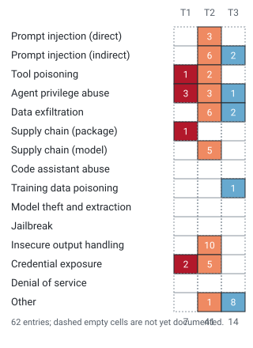

# awesome-ai-security

An evidence-graded catalogue of attacks on AI systems. Every entry is tagged with
how well the attack is established, so you can tell a documented incident from a
researcher's proof of concept from speculation.

<!-- BEGIN:GENERATED:count -->
**3** entries; last verified **2026-10-04**.
<!-- END:GENERATED:count -->

## Evidence tiers

<!-- BEGIN:GENERATED:tier-legend -->
- **Tier 1 - Confirmed in the wild.** Badge `T1 [===]`. A real system was affected, and a vendor advisory, postmortem, or CVE record states the finding.
- **Tier 2 - Demonstrated.** Badge `T2 [==-]`. The researcher reproduced the attack against a real build or model, but no occurrence outside a controlled setting is on record.
- **Tier 3 - Theoretical.** Badge `T3 [=-]`. The attack is argued from prior work; no working demonstration is published.
<!-- END:GENERATED:tier-legend -->

## Start here: confirmed in the wild

<!-- BEGIN:GENERATED:tier1 -->
| Tier | Entry | Date | Target | Primary source |
| --- | --- | --- | --- | --- |
| `T1 [===]` | [LiteLLM MCP endpoint authentication bypass via OAuth2 passthrough fallback](docs/entries/litellm-mcp-auth-bypass-oauth2-passthrough.md) | 2026-06-30 | BerriAI LiteLLM, versions before 1.84.0 (pip package litellm) | [github.com](https://github.com/BerriAI/litellm/security/advisories/GHSA-7488-6r32-c95q) |
| `T1 [===]` | [LiteLLM command execution through MCP stdio test endpoints](docs/entries/litellm-mcp-stdio-test-endpoint-command-injection.md) | 2026-05-08 | BerriAI LiteLLM 1.74.2 to before 1.83.7 (pip package litellm) | [cveawg.mitre.org](https://cveawg.mitre.org/api/cve/CVE-2026-42271) |
| `T1 [===]` | [LiteLLM unauthenticated SQL injection in proxy API key verification](docs/entries/litellm-proxy-api-key-sql-injection.md) | 2026-05-08 | BerriAI LiteLLM 1.81.16 to before 1.83.7 (pip package litellm) | [github.com](https://github.com/BerriAI/litellm/security/advisories/GHSA-r75f-5x8p-qvmc) |
<!-- END:GENERATED:tier1 -->

## Attack class x evidence tier

<!-- BEGIN:GENERATED:matrix -->

Cell colour encodes the evidence tier (darkest is Tier 1, confirmed in the wild); the numeral is how many entries sit there. A dashed empty cell means nothing is filed under that class at that tier yet.

| Attack class | T1 | T2 | T3 | Total |
| --- | --- | --- | --- | --- |
| Prompt injection (direct) | 0 | 0 | 0 | 0 |
| Prompt injection (indirect) | 0 | 0 | 0 | 0 |
| Tool poisoning | 1 | 0 | 0 | 1 |
| Agent privilege abuse | 0 | 0 | 0 | 0 |
| Data exfiltration | 0 | 0 | 0 | 0 |
| Supply chain (package) | 0 | 0 | 0 | 0 |
| Supply chain (model) | 0 | 0 | 0 | 0 |
| Code assistant abuse | 0 | 0 | 0 | 0 |
| Training data poisoning | 0 | 0 | 0 | 0 |
| Model theft and extraction | 0 | 0 | 0 | 0 |
| Jailbreak | 0 | 0 | 0 | 0 |
| Insecure output handling | 0 | 0 | 0 | 0 |
| Credential exposure | 2 | 0 | 0 | 2 |
| Denial of service | 0 | 0 | 0 | 0 |
| Other | 0 | 0 | 0 | 0 |
| **Total** | 3 | 0 | 0 | 3 |
<!-- END:GENERATED:matrix -->

## Full catalogue

<!-- BEGIN:GENERATED:catalogue -->
### Tool poisoning

| Tier | Title | Date | Target |
| --- | --- | --- | --- |
| `T1 [===]` | LiteLLM command execution through MCP stdio test endpoints | 2026-05-08 | BerriAI LiteLLM 1.74.2 to before 1.83.7 (pip package litellm) |

### Credential exposure

| Tier | Title | Date | Target |
| --- | --- | --- | --- |
| `T1 [===]` | LiteLLM MCP endpoint authentication bypass via OAuth2 passthrough fallback | 2026-06-30 | BerriAI LiteLLM, versions before 1.84.0 (pip package litellm) |
| `T1 [===]` | LiteLLM unauthenticated SQL injection in proxy API key verification | 2026-05-08 | BerriAI LiteLLM 1.81.16 to before 1.83.7 (pip package litellm) |
<!-- END:GENERATED:catalogue -->

## Entry pages

Every entry has a detail page carrying its full summary, impact, mitigation and
its sources. These pages are generated from `data/entries/*.yml`: edit the entry
file and rebuild rather than editing a page.

<!-- BEGIN:GENERATED:entry-index -->
### `T1 [===]` Tier 1 - Confirmed in the wild

- [LiteLLM MCP endpoint authentication bypass via OAuth2 passthrough fallback](docs/entries/litellm-mcp-auth-bypass-oauth2-passthrough.md) - Credential exposure - 2026-06-30
- [LiteLLM command execution through MCP stdio test endpoints](docs/entries/litellm-mcp-stdio-test-endpoint-command-injection.md) - Tool poisoning - 2026-05-08
- [LiteLLM unauthenticated SQL injection in proxy API key verification](docs/entries/litellm-proxy-api-key-sql-injection.md) - Credential exposure - 2026-05-08
<!-- END:GENERATED:entry-index -->

## How to read this list

<!-- BEGIN:GENERATED:footer -->
Every entry is graded on the evidence behind it, not on how alarming it sounds.

- [docs/TIERS.md](docs/TIERS.md) - what each tier means and how to disagree with one.
- [docs/METHODOLOGY.md](docs/METHODOLOGY.md) - how a finding is verified before it is filed.
- [docs/TAXONOMY.md](docs/TAXONOMY.md) - the attack classes and the tie-break rule between them.
- [dist/entries.json](dist/entries.json) - the same data, machine readable.
<!-- END:GENERATED:footer -->